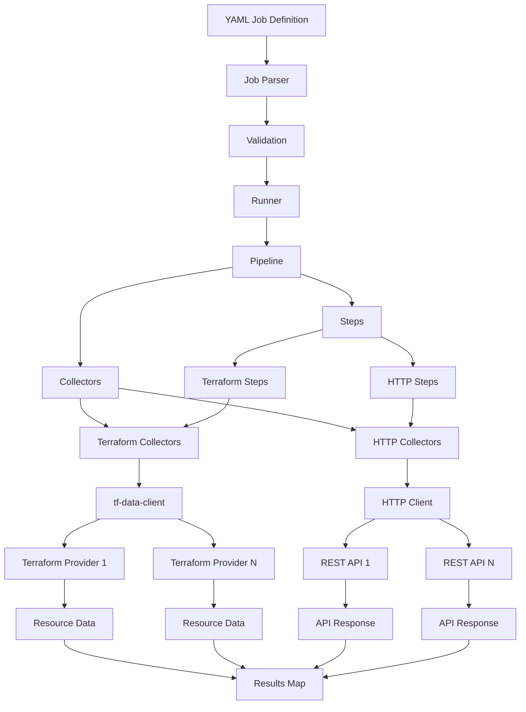

# infracollect Architecture

## System Overview

infracollect follows a pipeline-based architecture where YAML-defined collection jobs are parsed, validated, and
executed to collect infrastructure resources. It supports multiple collector types:

- **Terraform collectors**: Use Terraform providers via the `tf-data-client` library
- **HTTP collectors**: Make HTTP requests to REST APIs

## Architecture Diagram



## Component Breakdown

### 1. Job Parser

**Location**: `internal/runner/`

**Responsibilities**:

- Parse YAML files into `CollectJob` structs (defined in `apis/v1/`)
- Validate job structure and references using JSON Schema
- Ensure collector IDs referenced in steps exist
- Validate YAML schema against the `CollectJob` struct

**Key Functions**:

- `ParseCollectJob()`: Parses and validates YAML job files

### 2. Pipeline

**Location**: `internal/engine/pipeline.go`

**Responsibilities**:

- Manage collectors and steps in a single pipeline
- Provide collector lookup by ID
- Execute all steps and collect results
- Maintain lifecycle of collectors and steps

**Key Methods**:

- `AddCollector()`: Add a collector to the pipeline
- `AddStep()`: Add a step to the pipeline
- `GetCollector()`: Retrieve a collector by ID
- `Run()`: Execute all steps and return results

### 3. Collectors

**Locations**:

- `internal/collectors/terraform/` - Terraform provider collector
- `internal/collectors/http/` - HTTP REST API collector

**Responsibilities**:

- Abstract data collection from various sources
- Initialize and configure connections
- Execute queries/requests
- Manage lifecycle (start/close)

**Interfaces**:

- `Collector` (in `internal/engine/collector.go`)

#### Terraform Collector

**Responsibilities**:

- Wrap Terraform providers using `tf-data-client`
- Initialize and configure providers
- Execute data source queries

#### HTTP Collector

**Responsibilities**:

- Make HTTP requests to REST APIs
- Handle authentication (Basic auth)
- Manage headers, timeouts, and TLS settings
- Support gzip response decompression

### 4. Steps

**Locations**:

- `internal/collectors/terraform/steps.go` - Terraform data source steps
- `internal/collectors/http/steps.go` - HTTP request steps

**Responsibilities**:

- Represent a data collection operation
- Reference a collector
- Execute queries/requests through the collector
- Return results in standardized format

**Interfaces**:

- `Step` (in `internal/engine/step.go`)

**Implementations**:

- `dataSourceStep`: Executes Terraform data sources through terraform collectors
- `getStep`: Executes HTTP GET requests through HTTP collectors

### 5. tf-data-client Integration

**Location**: External library `github.com/adrien-f/tf-data-client`

**Responsibilities**:

- Directly run Terraform providers as library components (not via CLI)
- Create and configure provider instances
- Execute data source queries
- Manage provider lifecycle

**Key Features**:

- No need for OpenTofu CLI or HCL generation
- Direct Go library integration with Terraform providers
- Handles provider initialization and configuration internally

## Data Flow

### 1. Job Definition → Parsing

```text
YAML File → runner.ParseCollectJob() → CollectJob struct
```

### 2. Validation

```text
CollectJob → JSON Schema Validation → Validated Job
```

### 3. Pipeline Creation

```text
CollectJob → runner.createPipeline() → Pipeline with Collectors and Steps
→ terraform.NewCollector() → Collector instances
```

### 4. Collector Initialization

**Terraform Collectors**:

```text
Collector.Start() → tf-data-client.CreateProvider() → Provider instance
→ Provider.Configure() → Provider configured
```

**HTTP Collectors**:

```text
Collector.Start() → (no-op, HTTP client is ready)
```

### 5. Step Execution

**Terraform Steps**:

```text
Pipeline.Run() → Step.Resolve() → Collector.ReadDataSource()
→ tf-data-client Provider → Resource Data
→ Result struct
```

**HTTP Steps**:

```text
Pipeline.Run() → Step.Resolve() → Collector.Do(request)
→ HTTP Client → API Response
→ JSON/Raw parsing → Result struct
```

### 6. Result Collection

```text
Step Results → Map[string]Result → Returned to Runner
```

### 7. Result Writing

```text
Runner.WriteResults() → Encoder.EncodeResult() → Sink.Write() [per step]
→ Sink.Close() [after all steps; if ArchiveSink: Archiver.Close() → inner Sink.Write(archive) → inner Sink.Close()]
→ Files written (one per step, or one archive containing all steps) or stdout output
```

The Runner handles all result writing:

- Encodes each result using the configured encoder
- Writes to the configured sink (stdout, filesystem, S3, or ArchiveSink wrapping filesystem/S3)
- Without archive: each step's result is written as a separate file with filename `{step-id}.{extension}`
- With archive: each step's result is added to the archiver; on `Sink.Close`, the archive is written as one file (e.g.,
  `$JOB_NAME-$JOB_DATE_ISO8601.tar.gz`) to the inner sink
- Results include an `id` field identifying the step

## Multi-Collector Execution Model

### Isolation

Each collector operates independently:

**Terraform Collectors**:

- Each collector has its own provider instance managed by `tf-data-client`
- Providers are isolated at the library level
- No shared state between collectors

**HTTP Collectors**:

- Each collector has its own HTTP client instance
- Separate base URLs, headers, and authentication
- Connection pooling per collector

### Concurrent Execution

- Collectors are initialized sequentially (all started before steps run)
- Steps execute sequentially through the pipeline
- Each collector maintains its own provider instance
- Multiple steps can reference the same collector

### Step Execution

Steps reference collectors by ID:

```yaml
steps:
  # Terraform data source step
  - id: step1
    terraform_datasource:
      collector: k8s-collector # References terraform collector
      name: kubernetes_resources
      args: { ... }
  # HTTP GET step
  - id: step2
    http_get:
      collector: api-collector # References HTTP collector
      path: /users
      response_type: json
```

## Interface Contracts

### Collector Interface

```go
type Collector interface {
    Named
    Closer
    Start(context.Context) error
}
```

**Implementations**:

`terraform.Collector`:

- `Start()`: Initializes and configures the Terraform provider via `tf-data-client`
- `ReadDataSource()`: Executes a data source query (used by terraform steps)
- `Close()`: Cleans up the provider instance

`http.Collector`:

- `Start()`: No-op (HTTP client is created in constructor)
- `Do()`: Executes an HTTP request (used by HTTP steps)
- `Close()`: No-op (HTTP client cleanup is automatic)

### Step Interface

```go
type Step interface {
    Named
    Resolve(ctx context.Context) (Result, error)
}
```

Steps execute data collection operations and return results.

**Implementations**:

- `terraform.NewDataSourceStep()`: Creates steps that execute Terraform data sources
- `http.NewGetStep()`: Creates steps that execute HTTP GET requests

### Result Type

```go
type Result struct {
    ID   string `json:"id"`
    Data any    `json:"data"`
}
```

Results contain:

- `ID`: The step identifier that produced this result
- `Data`: The collected data from the step's data source query

### Runner

**Location**: `internal/runner/run.go`

**Responsibilities**:

- Orchestrate pipeline execution
- Manage collector lifecycle (start/close)
- Write results to configured sink
- Handle encoding and output formatting

**Key Methods**:

- `New()`: Creates a new Runner with pipeline, encoder, and sink
- `Run()`: Executes the pipeline and writes results
- `WriteResults()`: Encodes and writes results to the sink

**Output Behavior**:

- Without archive: writes one file per step with filename `{step-id}.{extension}`; for stdout each result is a separate
  line; for filesystem/S3 each result is its own file
- With archive: an `ArchiveSink` wraps the underlying sink; each step write is added to an in-memory archive; on `Close`,
  the archive is finalized and written as a single file (e.g., `.tar.gz`) to the inner sink

## Error Handling

- **Validation Errors**: Returned during job parsing/validation
- **Initialization Errors**: Returned when collectors fail to initialize
- **Execution Errors**: Returned when data source queries fail
- **Step Resolution Errors**: Returned when steps fail to resolve

All errors are wrapped with context and returned through the interface methods. Errors include relevant identifiers
(collector IDs, step IDs) to aid debugging.

## Logging

- Structured logging using `zap`
- Log levels: debug, info, warn, error, fatal
- Context-aware logging throughout the pipeline
- Collector-specific log contexts

## Output System

Results are written by the Runner through an encoder and sink. When `output.archive` is configured, an `ArchiveSink`
wraps the underlying sink and an `Archiver` bundles all step outputs into a single archive file.

### Encoders

**Location**: `internal/engine/encoders/`

**Responsibilities**:

- Encode results into specific formats (JSON, YAML, etc.)
- Provide file extensions for output files

**Interfaces**:

- `Encoder`: Encodes a single result to a reader

### Archivers

**Location**: `internal/engine/archiver.go` (interface), `internal/engine/archivers/` (implementations)

**Responsibilities**:

- Collect multiple files into an archive (tar with optional compression)
- Expose `AddFile` to add step outputs, `Close` to finalize and obtain the archive bytes, and `Extension` for the file
  extension (e.g., `.tar.gz`)

**Interfaces**:

- `Archiver`: `AddFile(ctx, filename, data)`, `Close() (io.Reader, error)`, `Extension() string`

**Implementations**:

- `archivers.TarArchiver`: Tar with gzip, zstd, or no compression (`.tar.gz`, `.tar.zst`, `.tar`)

### Sinks

**Location**: `internal/engine/sinks/`

**Responsibilities**:

- Write encoded data to destinations (stdout, filesystem, S3)
- Handle file creation and directory management

**Interfaces**:

- `Sink`: `Write(ctx, path, data)`, `Close(ctx)`, plus `Named`

**Types**:

- `StreamSink`: Writes to an `io.Writer` (typically stdout)
- `FilesystemSink`: Writes to files on the local filesystem
- `S3Sink`: Writes to S3-compatible object storage
- `ArchiveSink`: Wraps another sink; on each `Write`, adds the data to an `Archiver`; on `Close`, finalizes the archive
  and writes the single archive file to the inner sink, then closes the inner sink. Requires a filesystem or S3 sink;
  cannot wrap stdout.

### Writing Flow

1. Runner collects results from `Pipeline.Run()`.
2. If `output.archive` is set, the sink is an `ArchiveSink`; otherwise it is a `StreamSink`, `FilesystemSink`, or
   `S3Sink` directly.
3. For each result:
   - Encoder encodes the result.
   - **Without archive**: Sink writes with path `{step-id}.{extension}`.
   - **With archive**: `ArchiveSink.Write` adds the data to the `Archiver` under path `{step-id}.{extension}`.
4. On `Sink.Close`:
   - **Without archive**: Sink closes (no-op for stream/fs; S3 may flush).
   - **With archive**: `ArchiveSink.Close` calls `Archiver.Close`, writes the archive to the inner sink with the
     configured archive name (e.g., `$JOB_NAME-$JOB_DATE_ISO8601.tar.gz`), then closes the inner sink.

## Future Architecture Considerations

- **Plugin System**: Load collectors and output handlers dynamically
- **Caching Layer**: Cache provider schemas and collected data
- **Scheduler**: Support scheduled pipeline execution
- **API Server**: REST API for pipeline management
- **Web UI**: Dashboard for viewing collected resources
