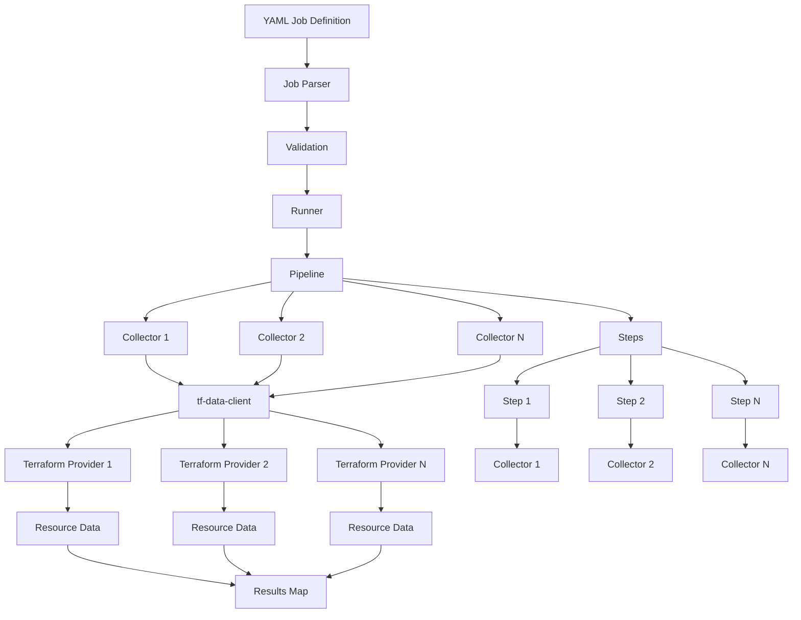

# infracollect Architecture

## System Overview

infracollect follows a pipeline-based architecture where YAML-defined collection jobs are parsed, validated, and executed to collect infrastructure resources using Terraform providers via the `tf-data-client` library.

## Architecture Diagram



## Component Breakdown

### 1. Job Parser

**Location**: `pkg/runner/`

**Responsibilities**:
- Parse YAML files into `CollectJob` structs (defined in `apis/v1/`)
- Validate job structure and references using JSON Schema
- Ensure collector IDs referenced in steps exist
- Validate YAML schema against the `CollectJob` struct

**Key Functions**:
- `ParseCollectJob()`: Parses and validates YAML job files

### 2. Pipeline

**Location**: `pkg/engine/pipeline.go`

**Responsibilities**:
- Manage collectors and steps in a single pipeline
- Provide collector lookup by ID
- Execute all steps and collect results
- Maintain lifecycle of collectors and steps

**Key Methods**:
- `AddCollector()`: Add a collector to the pipeline
- `AddStep()`: Add a step to the pipeline
- `GetCollector()`: Retrieve a collector by ID
- `Run()`: Execute all steps and return results

### 3. Collector

**Location**: `pkg/collectors/terraform/`

**Responsibilities**:
- Wrap Terraform providers using `tf-data-client`
- Initialize and configure providers
- Execute data source queries
- Manage provider lifecycle (start/close)

**Interfaces**:
- `Collector` (in `pkg/engine/collector.go`)

### 4. Step

**Location**: `pkg/collectors/terraform/steps.go`

**Responsibilities**:
- Represent a data collection operation
- Reference a collector and data source
- Execute data source queries through the collector
- Return results in standardized format

**Interfaces**:
- `Step` (in `pkg/engine/step.go`)

**Implementation**:
- `dataSourceStep`: Executes Terraform data sources through collectors

### 5. tf-data-client Integration

**Location**: External library `github.com/adrien-f/tf-data-client`

**Responsibilities**:
- Directly run Terraform providers as library components (not via CLI)
- Create and configure provider instances
- Execute data source queries
- Manage provider lifecycle

**Key Features**:
- No need for OpenTofu CLI or HCL generation
- Direct Go library integration with Terraform providers
- Handles provider initialization and configuration internally

## Data Flow

### 1. Job Definition → Parsing

```
YAML File → runner.ParseCollectJob() → CollectJob struct
```

### 2. Validation

```
CollectJob → JSON Schema Validation → Validated Job
```

### 3. Pipeline Creation

```
CollectJob → runner.createPipeline() → Pipeline with Collectors and Steps
→ terraform.NewCollector() → Collector instances
```

### 4. Collector Initialization

```
Collector.Start() → tf-data-client.CreateProvider() → Provider instance
→ Provider.Configure() → Provider configured
```

### 5. Step Execution

```
Pipeline.Run() → Step.Resolve() → Collector.ReadDataSource()
→ tf-data-client Provider → Resource Data
→ Result struct
```

### 6. Result Collection

```
Step Results → Map[string]Result → Returned to Runner
```

## Multi-Collector Execution Model

### Isolation

Each collector operates with its own provider instance managed by `tf-data-client`:
- Each collector has its own provider configuration
- Providers are isolated at the library level
- No shared state between collectors

### Concurrent Execution

- Collectors are initialized sequentially (all started before steps run)
- Steps execute sequentially through the pipeline
- Each collector maintains its own provider instance
- Multiple steps can reference the same collector

### Step Execution

Steps reference collectors by ID:

```yaml
steps:
  - id: step1
    terraform_datasource:
      collector: collector-1  # References collector by ID
      name: kubernetes_resources
      args: {...}
  - id: step2
    terraform_datasource:
      collector: collector-1  # Same collector, different data source
      name: aws_instances
      args: {...}
```

## Interface Contracts

### Collector Interface

```go
type Collector interface {
    Named
    Closer
    Start(context.Context) error
}
```

The `Collector` interface is implemented by `terraform.Collector` which provides:
- `Start()`: Initializes and configures the Terraform provider via `tf-data-client`
- `ReadDataSource()`: Executes a data source query (not part of interface, but used by steps)
- `Close()`: Cleans up the provider instance

### Step Interface

```go
type Step interface {
    Named
    Resolve(ctx context.Context) (Result, error)
}
```

Steps execute data collection operations and return results. The `terraform` package provides `NewDataSourceStep()` which creates steps that execute Terraform data sources.

### Result Type

```go
type Result struct {
    Data any
}
```

Results contain the collected data from a step's data source query.

## Error Handling

- **Validation Errors**: Returned during job parsing/validation
- **Initialization Errors**: Returned when collectors fail to initialize
- **Execution Errors**: Returned when data source queries fail
- **Step Resolution Errors**: Returned when steps fail to resolve

All errors are wrapped with context and returned through the interface methods. Errors include relevant identifiers (collector IDs, step IDs) to aid debugging.

## Logging

- Structured logging using `zap`
- Log levels: debug, info, warn, error, fatal
- Context-aware logging throughout the pipeline
- Collector-specific log contexts

## Future Architecture Considerations

- **Plugin System**: Load collectors and output handlers dynamically
- **Caching Layer**: Cache provider schemas and collected data
- **Scheduler**: Support scheduled pipeline execution
- **API Server**: REST API for pipeline management
- **Web UI**: Dashboard for viewing collected resources
