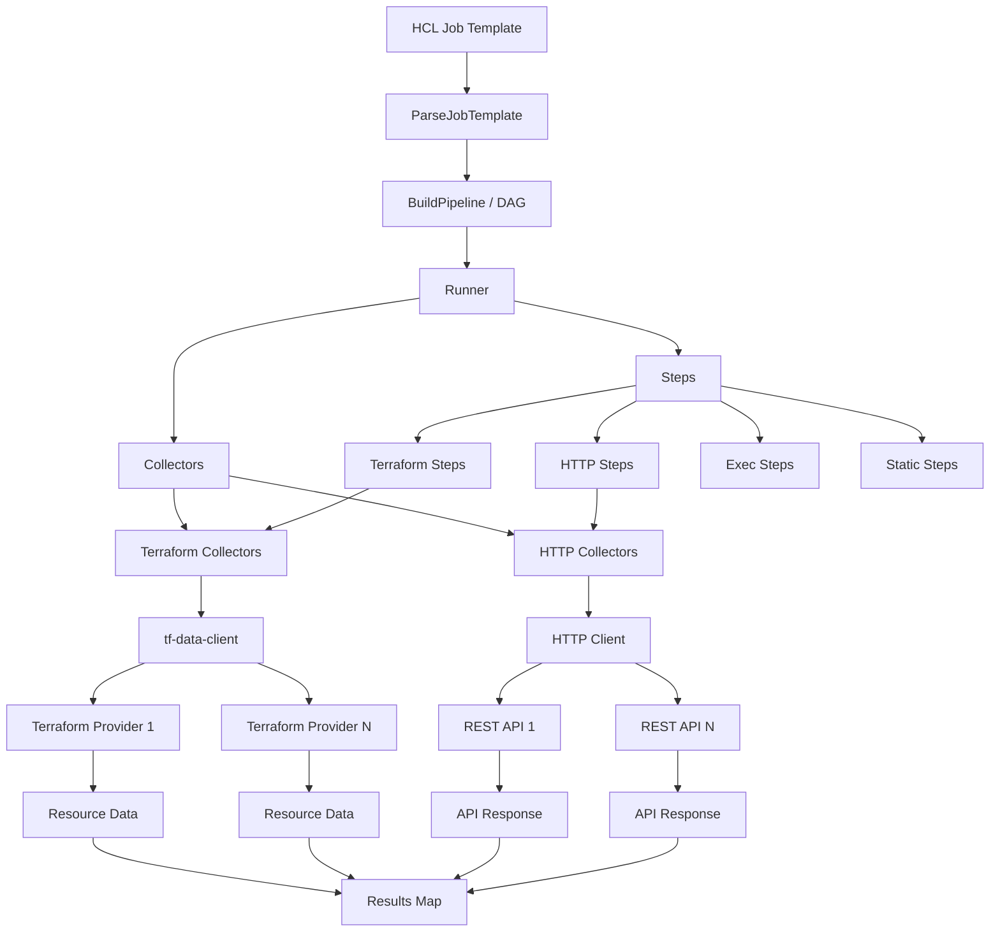

# infracollect Architecture

## System Overview

infracollect follows a pipeline-based architecture where HCL job templates are parsed into a DAG, then executed
topologically to collect infrastructure resources. It supports multiple collector types:

- **Terraform collectors**: Use Terraform providers via the `tf-data-client` library
- **HTTP collectors**: Make HTTP requests to REST APIs

## Architecture Diagram


```mermaid
flowchart TD
    HCL[HCL Job Template] --> Parser[ParseJobTemplate]
    Parser --> Build[BuildPipeline / DAG]
    Build --> Runner[Runner]

    Runner --> Collectors[Collectors]
    Collectors --> TFC[Terraform Collectors]
    Collectors --> HC[HTTP Collectors]

    TFC --> TFClient[tf-data-client]
    TFClient --> Provider1[Terraform Provider 1]
    TFClient --> ProviderN[Terraform Provider N]

    HC --> HTTPClient[HTTP Client]
    HTTPClient --> API1[REST API 1]
    HTTPClient --> APIN[REST API N]

    Provider1 --> Results1[Resource Data]
    ProviderN --> Results2[Resource Data]
    API1 --> Results3[API Response]
    APIN --> Results4[API Response]

    Runner --> Steps[Steps]
    Steps --> TFStep[Terraform Steps]
    Steps --> HTTPStep[HTTP Steps]
    Steps --> ExecStep[Exec Steps]
    Steps --> StaticStep[Static Steps]

    TFStep --> TFC
    HTTPStep --> HC

    Results1 --> Final[Results Map]
    Results2 --> Final
    Results3 --> Final
    Results4 --> Final
```

## Component Breakdown

### 1. Job Parser

**Location**: `internal/runner/template.go`

**Responsibilities**:

- Parse HCL files into `JobTemplate` structs
- Extract block labels (type, ID) for collectors and steps
- Preserve unevaluated `hcl.Body` for deferred decoding during execution

**Key Functions**:

- `ParseJobTemplate()`: Parses HCL bytes into a `JobTemplate` with source-range diagnostics

### 2. Pipeline / DAG

**Location**: `internal/runner/pipeline.go`, `internal/runner/dag.go`

**Responsibilities**:

- Build a directed acyclic graph (DAG) of collectors and steps
- Extract references from HCL expressions via `expr.Variables()` to wire edges
- Validate that all references resolve and no cycles exist
- Hold per-node metadata (decoded `hcl.Body`, references, `for_each` expression)

**Key Functions**:

- `BuildPipeline()`: Walks template collectors + steps, extracts references, builds DAG edges

### 3. Runner

**Location**: `internal/runner/run.go`

**Responsibilities**:

- Walk the DAG in topological order
- For each node, build an `hcl.EvalContext` with predecessor results stamped in
- Call integration factories to decode the `hcl.Body` and create collector/step instances
- Execute steps and collect results
- Write results to configured sink

**Key Functions**:

- `Run()`: Topological execution of the pipeline

### 4. Collectors

**Locations**:

- `internal/integrations/terraform/` - Terraform provider collector
- `internal/integrations/http/` - HTTP REST API collector

**Responsibilities**:

- Abstract data collection from various sources
- Initialize and configure connections
- Execute queries/requests
- Manage lifecycle (start/close)

**Interface** (in `internal/engine/collector.go`):

```go
type Collector interface {
    Named
    Closer
    Start(context.Context) error
}
```

#### Terraform Collector

- `Start()`: Initializes and configures the Terraform provider via `tf-data-client`
- `ReadDataSource()`: Executes a data source query
- `Close()`: Cleans up the provider instance

#### HTTP Collector

- `Start()`: No-op (HTTP client is created in constructor)
- `Do()`: Executes an HTTP request
- `Close()`: No-op

### 5. Steps

**Locations**:

- `internal/engine/steps/` - Built-in steps (static, exec)
- `internal/integrations/terraform/steps.go` - Terraform data source steps
- `internal/integrations/http/steps.go` - HTTP request steps

**Interface** (in `internal/engine/step.go`):

```go
type Step interface {
    Named
    Resolve(ctx context.Context) (Result, error)
}
```

Each integration defines its own HCL config struct with `hcl:"..."` tags. The factory receives an `hcl.Body` plus
the per-node `hcl.EvalContext` and calls `gohcl.DecodeBody` to populate the config.

### 6. tf-data-client Integration

**Location**: External library `github.com/infracollect/tf-data-client`

**Responsibilities**:

- Directly run Terraform providers as library components (not via CLI)
- Create and configure provider instances
- Execute data source queries
- Manage provider lifecycle

## Data Flow

### 1. Job Definition → Parsing

```text
HCL File → runner.ParseJobTemplate() → JobTemplate (with unevaluated hcl.Body fields)
```

### 2. Pipeline Building

```text
JobTemplate → runner.BuildPipeline() → Pipeline (DAG with nodes and edges)
```

### 3. Topological Execution

```text
Pipeline.DAG → topological walk → for each node:
  1. Build hcl.EvalContext (predecessor results, env vars, each.key/each.value)
  2. gohcl.DecodeBody → integration config struct
  3. Factory creates collector/step instance
  4. Execute (Start for collectors, Resolve for steps)
```

### 4. Result Writing

```text
Runner.WriteResults() → Encoder.EncodeResult() → Sink.Write() [per step]
→ Sink.Close()
→ Files written (one per step, or one archive containing all steps) or stdout output
```

## Output System

Results are written by the Runner through an encoder and sink. When `output.archive` is configured, an `ArchiveSink`
wraps the underlying sink and bundles all step outputs into a single archive file.

### Encoders

**Location**: `internal/engine/encoders/`

- Encode results into specific formats (currently JSON)
- Provide file extensions for output files

### Archivers

**Location**: `internal/engine/archiver.go` (interface), `internal/engine/archivers/` (implementations)

- Collect multiple files into an archive (tar with optional compression)
- `TarArchiver`: Tar with gzip, zstd, or no compression (`.tar.gz`, `.tar.zst`, `.tar`)

### Sinks

**Location**: `internal/engine/sinks/`

- `StreamSink`: Writes to an `io.Writer` (typically stdout)
- `FilesystemSink`: Writes to files on the local filesystem
- `S3Sink`: Writes to S3-compatible object storage
- `ArchiveSink`: Wraps another sink; adds each write to an archiver; on close, writes the archive to the inner sink

## Error Handling

- **Parse Errors**: Returned as `hcl.Diagnostics` with source ranges pointing at the offending token
- **Initialization Errors**: Returned when collectors fail to start
- **Execution Errors**: Returned when steps fail to resolve
- All errors are wrapped with context via `fmt.Errorf` with `%w`

## Logging

- Structured logging using `zap`
- Log levels: debug, info, warn, error, fatal
- Context-aware logging throughout the pipeline
